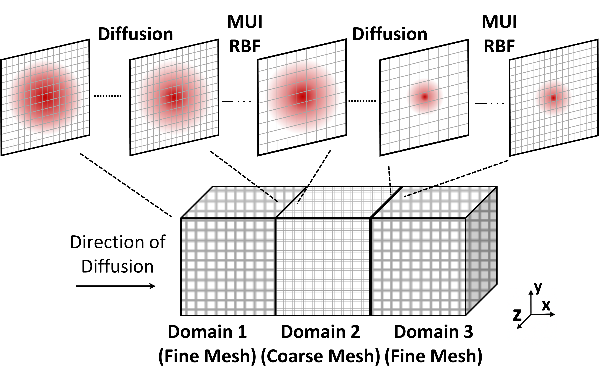

# Code Coupling

This section introduces the basic workflow for coupling solvers with MUI. It begins with a minimal two-solver example and then extends the discussion to more realistic multiphysics coupling patterns.

## Minimal Integration to Couple Two Solvers

To couple non-MPI embedded codes, one of the simplest yet illustrative examples of MUI’s basic functionality is provided in:

```text
MUI-demo/00-hello-world/hello.cpp
```

This example demonstrates how MUI transfers a `double` value between two instances of the same program running consecutively. Each instance acts as an independent application and exchanges data through a shared MUI interface.

A shortened version of the example is shown below.

```cpp
#include "mui.h"

int main(int argc, char ** argv) {

  mui::uniface1d interface(argv[1]);

  mui::sampler_exact1d<double> spatial_sampler;
  mui::temporal_sampler_exact1d temporal_sampler;

  mui::point1d push_point;
  mui::point1d fetch_point;

  std::cout << "domain " << argv[1]
            << " pushed value " << argv[2] << "\n";

  push_point[0] = 0;
  interface.push("data", push_point, std::atof(argv[2]));
  interface.commit(0);

  int time = 0;
  fetch_point[0] = 0;

  double v = interface.fetch("data",
                             fetch_point,
                             time,
                             spatial_sampler,
                             temporal_sampler);

  std::cout << "domain " << argv[1]
            << " fetched value " << v << "\n";

  return 0;
}
```

## Including the MUI Header

To use MUI in a C++ application, include the main header file:

```cpp
#include "mui.h"
```

MUI is header-only for C++ applications, so no separate MUI library needs to be linked for the C++ core. The compiler must still be given the correct include path to the MUI headers.

## Creating an Interface

The interface is created using:

```cpp
mui::uniface1d interface(argv[1]);
```

For different spatial dimensions, use the corresponding interface type:

| Dimension | Interface type   |
| --------- | ---------------- |
| 1-D       | `mui::uniface1d` |
| 2-D       | `mui::uniface2d` |
| 3-D       | `mui::uniface3d` |

The interface type also determines the expected point type and data dimensionality.

## Interface Identification

Each MUI interface is identified by a Uniform Resource Identifier (URI) with the general form:

```text
protocol://domainName/interfaceName
```

For MUI, the `protocol` is always mpi. The `domainName` is unique to each code instance, while the `interfaceName` should be shared by the applications that communicate through the same interface. A typical interface URI is:

```text
mpi:/domain1/ifs
```

## Defining Samplers

MUI uses spatial and temporal samplers to retrieve data from the interface.

```cpp
mui::sampler_exact1d<double> spatial_sampler;
mui::temporal_sampler_exact1d temporal_sampler;
```

In this minimal example, exact samplers are used. These are suitable when the fetch point exactly matches the pushed point in space and time.

For non-matching grids, more advanced samplers such as radial basis function samplers may be required.

## Defining Points

Data in MUI is associated with spatial points. For a one-dimensional interface:

```cpp
mui::point1d push_point;
mui::point1d fetch_point;
```

The point type must be consistent with the interface dimension.

For example:

| Interface        | Point type     |
| ---------------- | -------------- |
| `mui::uniface1d` | `mui::point1d` |
| `mui::uniface2d` | `mui::point2d` |
| `mui::uniface3d` | `mui::point3d` |

## Pushing Data

MUI represents data as a cloud of `Point`s, each with four attributes: label (name), position, time and value. To avoid fragmented communication, `Point`s of the same label are contained in a continuous container that is received collectively. Sending the data to the interface happens in two processes. (i) Call `push(label, position, value)`; (ii) After all the data associated with a time instance is pushed, a time stamp is given with the `commit(time)` to finalise transmission.

Data is sent to the interface using `push`

```cpp
push_point[0] = 0;
interface.push("data", push_point, 0.618);
```

Each pushed value is associated with:

* a label
* a spatial point
* a value
* a time stamp assigned during commit

The label is used to identify the data field. In this example, the label is:

```text
data
```

## Committing Data

After all values for a given time instance have been pushed, the data frame is finalised using `commit`

```cpp
interface.commit(0);
```

The argument is the time stamp. It is worth noting that the `push` and `commit` operations  processes are non-blocking.

## Fetching Data

To receive data, call the `fetch` function.

```cpp
double v = interface.fetch("data",
                           fetch_point,
                           time,
                           spatial_sampler,
                           temporal_sampler);
```

Unlike `push` and `commit`, `fetch` is blocking. It waits until the corresponding `Data Frame` has been committed by the peer application.

## Compiling the Example

MUI is a header-only library, that no pre-compilation is needed for C++ codes, and MUI is compiled as part of the host application. However, C, Fortran and Python wrappers require pre-compilation. MUI uses C++11 standard, and it has to be compiled with C++11 support and include the path to MUI header file. A simple compilation command is:

```bash
mpic++ -o ./hello ./hello.cpp -I/path/to/MUI -std=c++11
```

The key requirements are:

* use an MPI compiler wrapper such as `mpic++`
* include the path to the MUI headers
* enable C++11 support

## Running in MPI MPMD Mode

MUI uses MPI's MPMD mode to run independent applications simultaneously.

For the `hello-world` example, two instances can be launched as:

```bash
mpirun -np 1 ./hello mpi:/domain1/ifs 0.618 : \
       -np 1 ./hello mpi:/domain2/ifs 1.414
```

Here:

* `domain1` and `domain2` identify the two application instances
* `ifs` is the shared interface name
* `0.618` and `1.414` are values pushed by each instance

---

# Multiphysics-Oriented Coupling

The `MUI-demo/07-pseudo-diffusion` example provides a more realistic multiphysics coupling pattern. It solves a synthetic unsteady heat diffusion problem across coupled domains.

The setup consists of:

* one coarse domain
* two fine domains
* boundary data exchange between neighbouring domains
* non-conformal grid transfer

This example demonstrates several MUI features that are important for real multiphysics applications:

* centralised configuration
* multiple interfaces
* MPI communicator splitting
* smart send regions
* RBF-based spatial interpolation
* memory management using `forget`

## Example Structure

A shortened excerpt from the pseudo-diffusion example is shown below.

```cpp
#include "mui.h"
#include "demo7_config.h"

int main(int argc, char ** argv) {

  MPI_Comm world = mui::mpi_split_by_app();

  std::string domain = "fineDomain";

  std::vector<std::string> interfaces;
  interfaces.emplace_back("interface2D01");
  interfaces.emplace_back("interface2D02");

  auto ifs = mui::create_uniface<mui::demo7_config>(domain,
                                                    interfaces);

  mui::geometry::box<mui::demo7_config> send_region({y0, z0pr},
                                                    {(y0 + ly0), (z0pr + lz0pr)});

  ifs[0]->announce_send_span(0, steps, send_region);

  mui::sampler_rbf<mui::demo7_config> spatial_sampler(rSampler,
                                                      point2dvec,
                                                      basisFunc,
                                                      conservative,
                                                      smoothFunc,
                                                      generateMatrix,
                                                      fileAddress,
                                                      cutoff,
                                                      cgSolveTol,
                                                      cgMaxIter,
                                                      pouSize,
                                                      preconditioner,
                                                      world);

  mui::temporal_sampler_exact<mui::demo7_config> temporal_sampler;

  ifs[0]->forget(t - forgetSteps);
}
```



## Centralised Configuration
In MUI, interfaces can be defined in two ways:
* Using specialised classes (uniface1d/2d/3d with matching `Point` types), or
* Using a templated configuration approach via a project-specific `config.h` and included in solvers.

For larger coupled applications, it is recommended to use a central configuration structure rather than hard-coded interface specialisations. A typical configuration header is:

```cpp
#ifndef DEMO7_CONFIG_H
#define DEMO7_CONFIG_H

namespace mui {

struct demo7_config {
  using EXCEPTION = exception_segv;

  static const bool DEBUG = false;
  static const int D = 2;
  static const bool FIXEDPOINTS = false;
  static const bool QUIET = false;

  using REAL = double;
  using INT = int;

  using point_type = point<REAL, D>;
  using time_type = REAL;
  using iterator_type = INT;

  using data_types = type_list<int, double, float>;
};

}

#endif
```

This approach ensures that all coupled solvers use consistent definitions for:

* spatial dimension
* floating-point type
* integer type
* point type
* time type
* supported data types

## Creating Multiple Interfaces

A solver may need to communicate with several neighbouring solvers or domain boundaries. MUI supports this by creating multiple interfaces from a list of interface names.

```cpp
std::string domain = "fineDomain";

std::vector<std::string> interfaces;
interfaces.emplace_back("interface2D01");
interfaces.emplace_back("interface2D02");

auto ifs = mui::create_uniface<mui::demo7_config>(domain,
                                                  interfaces);
```

The interfaces can then be accessed using standard indexing:

```cpp
ifs[0]->push(...);
ifs[1]->fetch(...);
```

## Splitting MPI Communicators

For MPI-embedded solvers, it is recommended to reserve `MPI_COMM_WORLD` for MUI-level communication and use separate local communicators for each solver.

MUI provides:

```cpp
MPI_Comm world = mui::mpi_split_by_app();
```

This creates a communicator for each application in an MPMD run. Existing solver-level MPI operations should then use this local communicator rather than `MPI_COMM_WORLD`.

This pattern keeps:

* global MUI communication visible across applications
* internal solver communication isolated within each application

Alternatively, `MPI_Comm_split` with `MPI_APPNUM` can be used for a pure MPI approach. Both patterns preserve global visibility for MUI while isolating each solver's internal MPI. To maintain local MPI operations, it is required to replace the existing communicator in each MPI-embedded applications with the one created by MUI, ensuring intra-solver MPI remains unaffected.

## Reduce Traffic with `Smart Send`

By default, MUI may use all-to-all communication. This is robust but can become expensive for large parallel simulations.

For scalable multi-rank runs, announce geometric send/receive regions (e.g., box, sphere, point, or line) through `Smart Send` at startup to allow MUI to prune unnecessary rank-to-rank messages. This typically reduces all-to-all patterns to near one-to-one at boundaries 

`Smart Send` reduces unnecessary communication by allowing each application to announce the spatial region it will send or receive data from.

For example:

```cpp
mui::geometry::box<mui::demo7_config> send_region({y0, z0pr},
                                                  {(y0 + ly0), (z0pr + lz0pr)});

ifs[0]->announce_send_span(0, steps, send_region);
```

Regions can be dynamically updated or removed by specifying a validity period by the first two arguments specify the validity period of the announced region. During this period, MUI can prune unnecessary rank-to-rank communication. After expiration, MUI reverts to all-to-all communication.

This is particularly useful for boundary-coupled simulations where only a small subset of ranks participate in data exchange.

## RBF Sampler

The pseudo-diffusion example uses a radial basis function sampler for non-conformal data transfer.

```cpp
mui::sampler_rbf<mui::demo7_config> spatial_sampler(...);
```

The RBF sampler is useful when:

* source and target meshes do not match
* interpolation is required between different grid resolutions
* conservative or smoothed transfer is needed
* data is exchanged across non-conformal interfaces

This makes it suitable for practical multiphysics simulations involving different solvers or different mesh resolutions.

## Memory Management with `forget`

Long-running coupled simulations can accumulate many data frames. MUI provides the `forget` function to discard data that is no longer required.

```cpp
ifs[0]->forget(t - forgetSteps);
```

This removes data older than the specified threshold and keeps memory usage manageable.

This is especially important for asynchronous simulations and long transient calculations.
